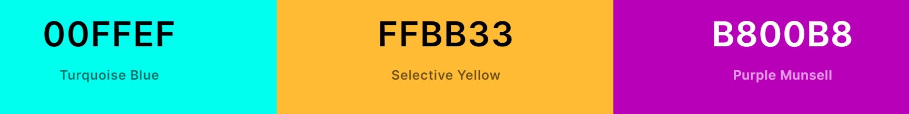
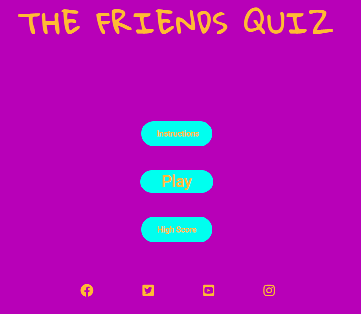
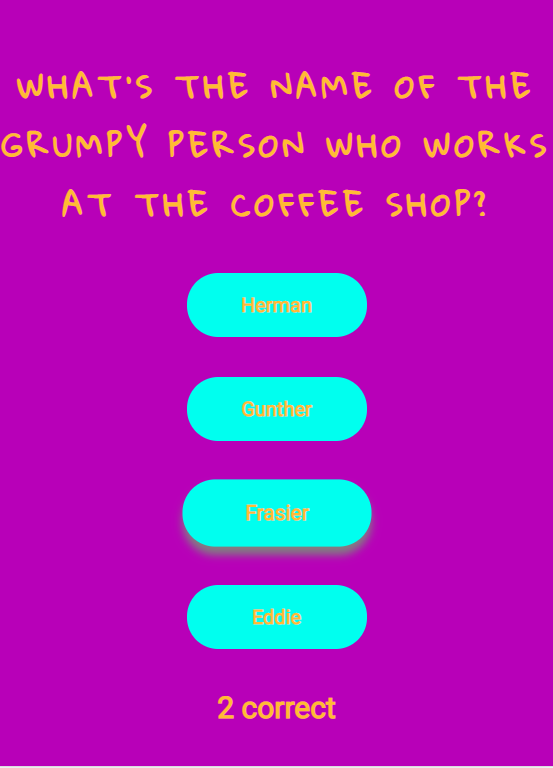

# MS-2-FRIENDS-QUIZ

An Interactive Front-End Development Project using HTML, CSS and Javascript

## **Table of Contents**

- [About](<#About>)
- [Users Experience](<#users-experience>)
  - [Project Goals](#project-goals)
  - [Target Audience](#target-audience)
  - [User Stories](#user-stories)
  - [Design](#design)
- [Features](#Features)
  - [Existing Features](#existing-features)
  - [Future Features](#Future-features)
- [Technologies-Used](#Technologies-Used)
- [Testing](#Testing)
- [Deployment](#Deployment)
- [Acknowledgements](#Acknowledgements)

## **About**

Welcome to my Friends TV Show Quiz!

As a huge fan of online quizzes from the weekly Joe.ie quiz to history quizzes on Sporacle, I thought this would be a great opportunity to create my own. I decided on a quiz about the TV show Friends as it is extremely popular and has a huge fanbase that loves testing their knowledge.

The questions range from very easy to extremely tricky with only a Friends fanatic being able to answer all of them correctly. 

The live website can be found [here](X).

## **Users Experience**

### **Project Goals**

When creating this quiz, my first goal was to ensure a fun experience for fans of Friends which would test their trivia knowledge with a intuitive design. 

My second gaol was to further my understanding and proficiency with javascript as this is my first interactive front-end development project.

### **Target Audience**

The target audience for this quiz is the fanbase of the tv show. This is an very large group as the show was initially released in 1994 but gained popularity again in recent years through services such as Netflix. I believe the majotiy of this group would be between 18 - 30.

### **User Stories**

- **General User Goals**
  - As a fan of the Friends TV Show, I want enjoy activities related to the show. 
  - As a fan of online quizzes, I want to test and measure my knowledge to see how much I know. 

- **First Time User Goals**
  - As a first time user, I want to easily understand how to navigate the site and play the game. 
  - I want to have an enjoyable experience, playing the quiz which entices me to return.
  - I want to be challenged at stages to test my knowledge.

- **Returning User Goals**
  - As a returning user, I want to be able to play the quiz multiple times and still encounter new questions.
  - I want to beat my best score which will be saved in local storage. 

### **Design**

- **Colour Scheme**

The color scheme was inspired initially Monica's purple apartment door with the yellow frame which is iconic on the show. The turquoise were chosen to compliment these colours and create a fun theme. 

- **Typography**

  - For the main headers, I chose "Gloria Hallelujah" from Google Fonts as this was quite similar to the styling of the Friends logo with an aim to inspire nostalgia. 

  - For the text throughout the body, I chose "Roboto" as I thought this complimented the header font and was quite clear to read on the buttons. 

## **Features**

### **Existing Features**

- Homepage which consists of buttons for instructions, high score and play.

- Footer on homepage with clickable social media icons for navigating to related pages. 

- Question counter - shows the current question you are on and how many you have left. 

- Score tracker - shows how many questions you have got correct. 

- Question display with buttons displaying the possible answers. 

- Modal once quiz is complete to show your score and then direct you back to the homepage. 

### **Future Features**

- Add a multiplayer option so you can play against your friend and see how knows more. 

- Add a share score feature so people can share about their score with their friends and promote the site through social media.

## **Technologies Used**

### **Languages Used**

- [HTML5](https://en.wikipedia.org/wiki/HTML#:~:text=The%20HyperText%20Markup%20Language%2C%20or,displayed%20in%20a%20web%20browser.)

  - The language used to give the site structure.

- [CSS3](https://en.wikipedia.org/wiki/CSS)

  - The language used to style the visual effects including the font, color and layout etc.

- [Javascript](https://developer.mozilla.org/en-US/docs/Web/JavaScript)

  - The language used to implement the site's interactive features, allow the user to take actions throughout their vist to the site.

### Frameworks, Libraries & Programs Used

- [Gitpod](https://code.gitpod.io/)

  - Gitpod has been used as a local code editor to write and manage all codes and files.

- [Github](https://github.com/)

  - Github is used to create, store and maintain all codes in a repository.

  - Github is also used as the site hosting service for the final website to be published on.

- [Google Fonts](https://fonts.google.com/)

  - The font used on this quiz were chosen from Google fonts.

- [Fontawesome](https://fontawesome.com/)

  - The icons used on the footer were taken from Fontawesome.

- [Google DevTools](https://developer.chrome.com/docs/devtools/)

  - Google DevTools was used throughout this project for styling, testing and debugging purposes.

- [Am I Responsive](http://ami.responsivedesign.is/)

  - Am I responsive has been used to test the responsiveness of the site and also to create the mock-up image presented at the start of this document.

- [W3C Markup Validation service](https://validator.w3.org/)

  - W3C Markup Validation Service has been used to test the HTML codes.

- [W3C CSS Validation Service](https://jigsaw.w3.org/css-validator/)

  - W3C CSS Validation Service has been used to test the CSS codes.

- [coolors](https://coolors.co/)

  - coolors has been used to decide the color scheme for the site.

## **Testing**

- User Experience Testing

  - When first creating the quiz, I initially arranged the answer options in a column which was suitable for smaller screens but found that it left large areas empty on computer screens. To resolve this, I used media queries to arrange them in 2 rows on screen sizes above 490px. 

  - When the quiz was first being tested we found that the same question could be displayed within the same game, this was resolved by adding a splice to the question selector which then removed that question from the array temporarily. 

  - When testing different screen sizes, I found that some fonts were too large on mobile screens, this was resolved by adding media queries to reduce font sizes and also remove padding between buttons. 

- Validators

- Please see [here](assets/images/homepagevalid.PNG) for image of the homepage HTML Validator.

- Please see [here](assets/images/questionpagevalid.PNG) for image of the Question page HTML Validator.

- Please see [here](assets/images/cssvalid.PNG) for CSS Validator.

## **Deployment**

### **Deploy To GitHub Pages**

1. Logged into Github account.

2. Select repository.

3. Select MS-2-FRIENDS-QUIZ.

4. On the top right navigation click on settings.

5. Under the settings section, scroll down to the GitHub Pages section.

6. Select Main Branch from the source dropdown menu.

7. Click save.

8. Once clicked, this publishes the project to GitHub Pages and displays the site URL. Click on the URL to view the live site.

### **Making a clone or download zip to run locally**

1. Log into GitHub account.

2. Select repository.

3. Select MS-2-FRIENDS-QUIZ.

4. Click on the Code dropdown button next to the green Gitpod button.

5. Click on the clipboard icon to copy the clone URL.

6. Open Git Bash.

7. Change the current working directory to the location where you want the cloned directory.

8. Type "git clone" in the Command Line and then paste the URL copied in step 5.

9. Press enter to create your local clone.

10. Alternately, click on Download ZIP, unpack locally and open with a local code editor.

### **Forking the GitHub Repository**

1. Log into GitHub.

2. Select repository.

3. Select MS-2-FRIENDS-QUIZ.

4. At the very top right corner click "fork".

5. You will have a copy of the original repository in your own GitHub account.

## **Acknowledgements**

I need to credit:

[James Q Quick's youtube videos](https://www.youtube.com/playlist?list=PLDlWc9AfQBfZIkdVaOQXi1tizJeNJipEx)

[CodeExplained quiz youtube videos](https://www.youtube.com/watch?v=49pYIMygIcU)

I would like to thank: 

- My mentor, Spencer Barribell for his guidance and patience when I encountered issues.
- My girlfriend Francesca, for allowing me to bounce ideas off her and for testing the quiz more times than I can count.